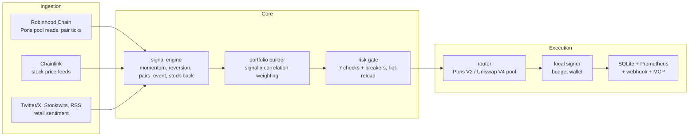

<div align="center">


# Pons Pal


</div>

<br>

> agentic trading for [ponsfamily.com](https://ponsfamily.com) &nbsp;|&nbsp; RWA token-stock pairs &nbsp;|&nbsp; Robinhood Chain

Pons Pal is the trading agent behind pons.family. It watches the Pons pair
pools on Robinhood Chain, the Chainlink feeds for the stocks those pairs are
tied to, and what Robinhood retail is saying about them, then sizes a book,
runs every order through a risk gate, and swaps on-chain from a wallet you
fund for it and nothing else.

It runs in paper mode until you hand it a key. It stops when you tell it to.
It does not resume on its own after a loss.

Site: [ponsfamily.com](https://ponsfamily.com) &nbsp;|&nbsp; X: [@ponsdotfamily](https://x.com/ponsdotfamily)

---

## Status

```
+----------------------------------------------------------+
|  chain     Robinhood Chain (ID 4663)                     |
|  wallet    dedicated budget wallet, set in .env          |
|  mode      PAPER by default, LIVE needs a key + router   |
|  session   09:30 to 16:00 ET for stock feeds, tokens 24/7|
|  asset     Pons token / tokenized stock pairs (V2 pools) |
|  rpc       rpc.mainnet.chain.robinhood.com               |
|  metrics   127.0.0.1:8000/metrics                        |
|  mcp       127.0.0.1:8765/mcp (bearer secret)            |
+----------------------------------------------------------+
```

The router address, the Chainlink feed map, and the USDG address are blank in
`config/pons.yaml` until they are confirmed against ponsfamily.com. A blank
router keeps the agent unarmed even if a key is present.

---

## How it works

One process, one event loop, six event types. Each stage is a handler on the
bus and the bus drains between stages, so every signal is seen before any
order is built and every order is judged before any fill exists.



Strategies get a frozen copy of the book and return signals. They cannot
place orders. The portfolio builder turns signals into orders, the gate says
PASS, REDUCE, or BLOCK, and the router re-checks the gate's answer at the
moment of submission before anything is signed.

---

## The stock-back edge

On a Pons token-stock pair the trading-fee cashback is paid in the tokenized
stock, not in cash. Hold the pair and you accrue the underlying at a rate set
by the pair's fee flow:

```
accrual_rate_daily = fee_flow_24h_usd * stockback_share / liquidity_usd
```

`strategies/stockback.py` ranks the universe by that rate times a quality
score for the paired stock (recent trend, whether its feed is fresh), buys the
top `top_k`, and sells a held pair whose accrual has stopped. The gate refuses
any buy below `stockback_min_rate`, so the strategy can only propose pairs
where stock-back is actually live.

This is a heuristic, not a promise. Fee flow is reflexive and launchpad
tokens are thin.

---

## Risk

Seven checks run in order before every order. Thresholds hot-reload from
`config/risk.yaml`.

| # | Check | Threshold | Action |
|:---:|---|---|:---:|
| 1 | Intraday P&L | < -2% equity | BLOCK |
| 2 | Weekly P&L | < -5% equity | BLOCK |
| 3 | Monthly P&L | < -10% equity | BLOCK |
| 4 | Chain exposure | > 10% equity | BLOCK |
| 5 | Position notional | > 5% equity | REDUCE |
| 6 | Pair concentration (one stock) | > 25% | BLOCK |
| 7 | 24h on-chain volume | < $1M | BLOCK |

Pons-specific checks run after those: the stock feed must be fresh, stock-back
must be live on a buy, the paired stock must not be down more than 15% over
five sessions, and the ETH gas reserve is never spent. Slippage and price
impact are capped in the gate and again at submission.

> [!WARNING]
> Checks 1 to 3 are circuit breakers. A trip is written to the database before
> the block is returned, blocks sells as well as buys, survives a restart, and
> clears only with `pons-pal resume --breaker <name> --confirm`.

---

## Signal sources

| Source | Type | Role |
|---|---|---|
| Robinhood Chain pool reads | Pons pair price and volume | Primary |
| Chainlink stock feeds | Paired stock price | Pairs strategy, freshness gate |
| Equities data provider | Stock history | Trend quality for stock-back |
| Twitter/X (fintwit) | Social sentiment | Event drift |
| Stocktwits | Social sentiment | Event drift |
| News RSS | Headlines | Event drift |

Sentiment is a weighted mean over the sources that answered. With fewer than
`min_sources` there is no score at all. Sentiment feeds the event strategy
only; it never sizes an order by itself.

---

## Config

```yaml
# config/default.yaml
engine:
  mode: paper
  cycle_interval_s: 60
  paper_equity_usd: 10000

capital:
  per_order_max_usd: 500
  daily_notional_max_usd: 5000
  eth_gas_reserve: 0.02

universe:
  allow_bonding_curve: false     # graduated V4 pools only
  min_liquidity_usd: 250000
  min_volume_24h_usd: 1000000
  max_pairs: 25
```

```yaml
# config/risk.yaml
intraday_loss_pct: 2.0
weekly_loss_pct: 5.0
monthly_loss_pct: 10.0
chain_exposure_pct: 10.0
max_position_pct: 5.0
max_sector_pct: 25.0
min_adv_usd: 1000000

feed_max_age_s: 900
stockback_min_rate: 0.0005
underlying_max_drawdown_pct: 15.0
max_slippage_bps: 100
max_price_impact_bps: 150
hot_reload: true
```

```yaml
# config/sentiment.yaml
sources:
  twitter:    { enabled: false, weight: 1.0 }
  stocktwits: { enabled: false, weight: 1.0 }
  rss:        { enabled: false, weight: 0.5 }
blend:
  min_sources: 1
  half_life_s: 3600
```

Secrets never go in YAML. They come from `.env`, see `.env.example`.

---

## Run

```bash
python3.11 -m venv .venv && source .venv/bin/activate
pip install -r requirements.txt && pip install -e ".[dev]"
cp .env.example .env
```

```bash
pons-pal cycle          # one pass, prints the report
pons-pal run            # cycles every 60 s until interrupted
pons-pal state          # what the agent thinks about itself, as JSON
pons-pal disclosure     # same thing as text, with the limits in force
pons-pal disarm         # kill switch, persists across restarts
```

Every command prints the banner first. Everything runs in paper mode with no
key. See [docs/quickstart.md](docs/quickstart.md) and
[docs/OPERATIONS.md](docs/OPERATIONS.md) for arming, halting, and resuming.

---

## Monitoring

Prometheus on `127.0.0.1:8000/metrics`:

| Metric | Description |
|---|---|
| `pons_pal_equity_usd` | Book equity |
| `pons_pal_pnl_today_usd` | Intraday P&L |
| `pons_pal_drawdown_pct` | Drawdown from peak equity |
| `pons_pal_wallet_balance_usd` | Budget wallet balance |
| `pons_pal_positions_count` | Open positions |
| `pons_pal_fills_total{side,simulated}` | Fills, paper and live |
| `pons_pal_chain_errors_total` | On-chain submission errors |
| `pons_pal_risk_blocks_total{check}` | Orders blocked, by check |
| `pons_pal_stockback_accrued_usd` | Stock-back accrued across the book |
| `pons_pal_order_latency_seconds` | Order submission latency (histogram) |
| `pons_pal_armed` | 1 when live execution is possible |
| `pons_pal_breaker_tripped{breaker}` | 1 while a breaker is tripped |
| `pons_pal_feed_age_seconds{feed}` | Age of the last stock feed reading |

Every gate decision and every fill also posts to the webhook in
`PONS_PAL_WEBHOOK_URL`, refusals included.

---

## Layout

```
pons-pal/
├── src/pons_pal/
│   ├── core/           engine, events, portfolio, risk, session, universe
│   ├── strategies/     momentum, mean_reversion, pairs, event, stockback
│   ├── data/           feeds, normalizer, cache, historical
│   ├── execution/      router, slippage, fills
│   ├── adapters/       chain, sentiment, stockback
│   ├── agent/          mcp, notify, disclosure
│   ├── monitoring/     metrics (Prometheus)
│   └── cli, app, config, models, keys, signer, net, store, log
├── config/             default.yaml, risk.yaml, sentiment.yaml, pons.yaml
├── tests/              config, risk, strategies, stockback, security, pipeline
└── docs/               quickstart, signals, risk-model, execution, deployment, OPERATIONS
```

---

## Safety

- The agent signs only from a wallet you fund for it. The key must derive
  `PONS_PAL_BUDGET_ADDRESS` or the process aborts at startup.
- `PONS_PAL_MODE` defaults to `paper`. Without a key every stage runs except
  the swap, and the state says `unarmed`.
- `pons-pal disarm` stops execution immediately and stays set across restarts.
  Lifting it needs `arm --confirm`.
- Every outbound request (RPC, sentiment, stock data, pair index, webhook)
  goes through one guard: https only, host allowlist, private and metadata
  addresses refused, no redirects.
- The MCP endpoint needs a bearer secret on every request and refuses to
  start without one. Metrics and MCP bind to loopback.

Threat model and invariants in [SECURITY.md](SECURITY.md). Event bus and
boundaries in [ARCHITECTURE.md](ARCHITECTURE.md).

---

## Disclaimer

Agentic trading carries significant risk, including total loss. Pons RWA and
launchpad tokens are extremely high-risk and can go to zero. An AI agent can
misread data, act on stale data, or be wrong in ways it cannot detect. Nothing
here is financial advice. You are accountable for the agent you run and the
wallet you fund. The software is provided as is, without warranty.

---

## Contributing

```bash
make install
make check      # ruff, mypy --strict, pytest, pip-audit, bandit
```

See [CONTRIBUTING.md](CONTRIBUTING.md). MIT, © 2026 Pons Labs, LLC.
